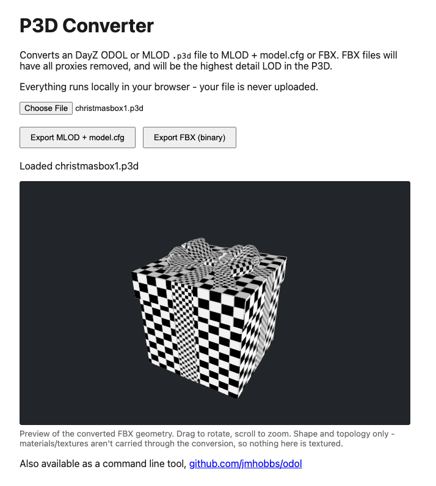

# ODOL

This repo contains tooling to convert Bohemia Interactive P3D files from ODOLv6 and ODOLv7 to MLOD format, or any P3D to FBX.

## Usage

### Web

The tool is available in your browser at [tools.dzhosts.com](https://tools.dzhosts.com/p3d-converter/). This is the easiest way to use it, and it should work on any platform.



### CLI

If you'd like the tool locally, you can build it from source or get the latest release from [GitHub](https://github.com/jmhobbs/odol/releases)

The tool takes an input P3D file and emits an MLOD version and a model.cfg file to match.  Optionally, you can export the highest resolution LOD to FBX.

```
$ odol-convert
usage: odol-convert [--fbx] [--fbx-ascii] <input.p3d>
  -fbx
        export FBX instead of MLOD
  -fbx-ascii
        export ASCII FBX instead of binary (implies --fbx)

$ odol-convert m4a1.p3d
convert:        input P3D: m4a1.p3d
convert:      output MLOD: m4a1_mlod.p3d
convert: output model.cfg: m4a1.model.cfg

convert: detected input format: ODOLv6
convert: converting ODOLv6 to MLOD + model.cfg
convert: parsing ODOL data
convert: validating full decode
convert: writing output files
convert: conversion complete

$ odol-convert --fbx m4a1.p3d
convert:   input P3D: m4a1.p3d
convert:  output FBX: m4a1.fbx
convert: detected input format: ODOLv6
convert: converting ODOLv6 to FBX
convert: parsing ODOL data
convert: validating full decode
convert: writing FBX
convert: conversion complete

$ ls -lart
-rw-r--r--@   1 jmhobbs  staff   811824 Jul 15 10:58 m4a1.p3d
-rw-r--r--@   1 jmhobbs  staff  5861839 Jul 15 10:58 m4a1_mlod.p3d
-rw-r--r--@   1 jmhobbs  staff      680 Jul 15 10:58 m4a1.model.cfg
-rw-r--r--@   1 jmhobbs  staff  1461634 Jul 15 12:22 m4a1.fbx
```

## Contributing

Find a bug? I'm not surprised. This is clanker code, generated from BI wiki docs and lots of sample files.  File an issue and send me your input file and we will see what can be done about it, but I wouldn't go reading the code if I was you.
